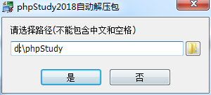
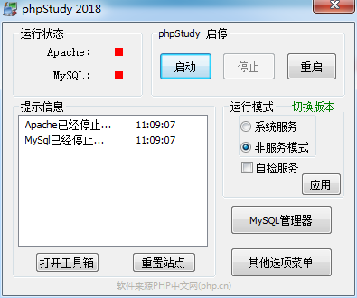
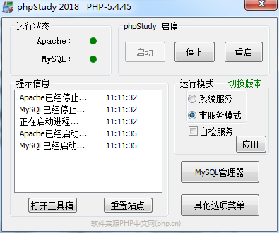
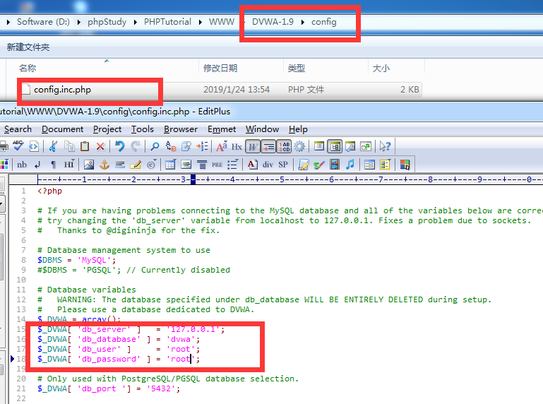
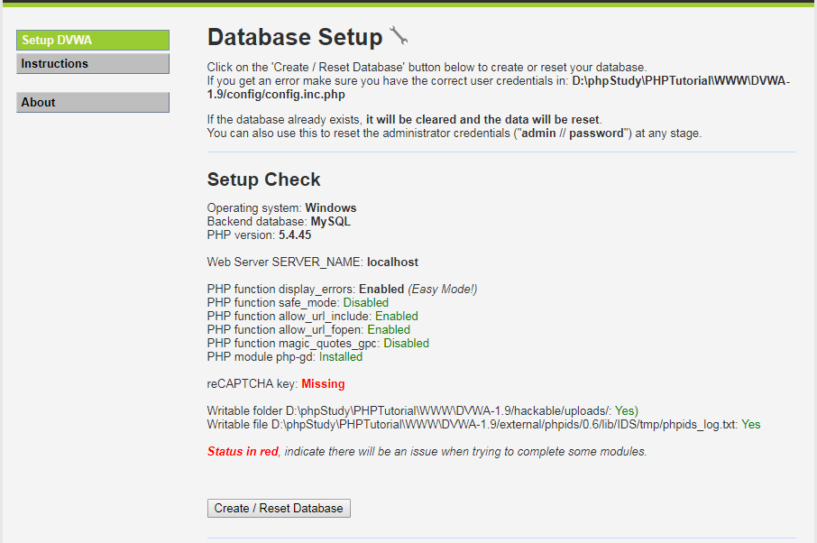
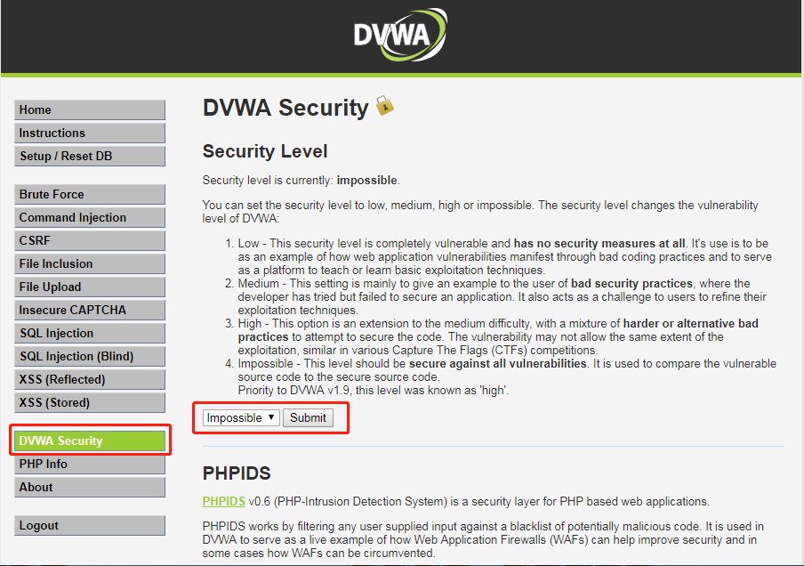

# DVWA介绍与环境搭建 #

## 介绍 ##

DVWA是一个基于PHP和MySQL开发的漏洞测试平台

## 测试环境 ##

+ 系统：win7
+ 应用程序: phpStudy(apache，php，mysql)
+ dvwa: 1.9
+ 测试程序: firefox， new hacker， burpsuite，sqlmap，中国菜刀

## phpStudy下载部署 ##

1. 下载地址：[http://phpstudy.php.cn/download.html](http://phpstudy.php.cn/download.html)

2. 解压并运行exe进行安装

    

3. 运行phpStudy.exe启动程序

    

4. 启动服务

    

5. 访问

    + [http://localhost/phpinfo.php](http://localhost/phpinfo.php)
    + [http://localhost/l.php](http://localhost/l.php)
    + [http://localhost/phpinfo.php](http://localhost/phpinfo.php)

6. 使用

    A. MySQL

        默认用户名/密码: root/root

      B. 修改密码

        其他选项菜单 => MySQL工具 => 设置或修改密码

    C. 切换软件版本

    D. 软件端口设置

        其他选项菜单 => 软件设置 => 端口常规设置

    E. 站点设置

        其他选项菜单 => 站点域名设置

    F. 参数设置

        a. PHP参数设置

            其他选项菜单 => PHP扩展及设置

        b. Apache参数设置

            其他选项菜单 => PHP扩展及设置 => Apache模块

        c. MySQL参数设置

            其他选项菜单 => MySQL工具 => 参数值设置

## DVWA下载&部署 ##

1. 下载地址： [https://github.com/ethicalhack3r/DVWA](https://github.com/ethicalhack3r/DVWA)

2. 解压到phpStudy的web目录

3. 修改数据库配置

    

4. 访问同时点击create/reset database进行数据库初始化

    [http://localhost/DVWA-1.9](http://localhost/DVWA-1.9)

    

5. 登陆

    默认账号密码: admin/password

## 安全级别 ##

1. DVWA分四个安全级别，同时通过页面进行设置，四个安全级别说明：

    + low: 安全级别低，没有任何安全措施，容易受到攻击
    + medium: 安全级别中，尝试提供安全措施，但未能保护应用程序，为不良的安全实践
    + high: 安全级别高，尝试提供混合的更难或者替换的安全措施保护代码，漏洞利用难度类似于CTF
    + impossible: 安全的，默认级别

2. DVWA将安全级别设置于cookie中

    
