# DVWA之命令注入 #

## 漏洞概述 ##

命令注入是指在易受攻击的应用程序中注入和执行攻击者指定的命令，执行的命令具有与web服务相同的权限和环境。

## 测试工具 ##

firefox浏览器

## 测试方法 ##

### LOW级别 ###

1. 设置DVWA安全级别为LOW

2. 使用firefox浏览器发起登陆请求

    分别填写以下提交数据:

    + 127.0.0.1&&id
    + 127.0.0.1&&net user
    + testcmdinjection||id
    + testcmdinjection||net user
    + 127.0.0.1&id
    + 127.0.0.1|net user
    + testcmdinjection&id
    + testcmdinjection|net user

    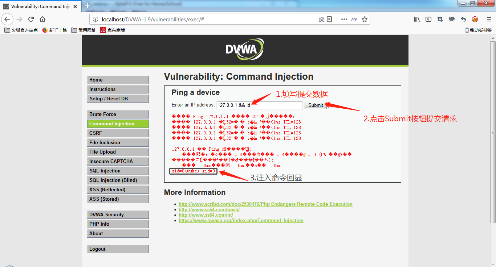

    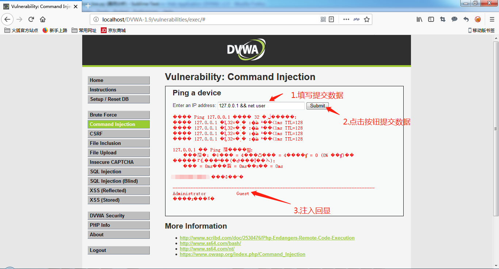

    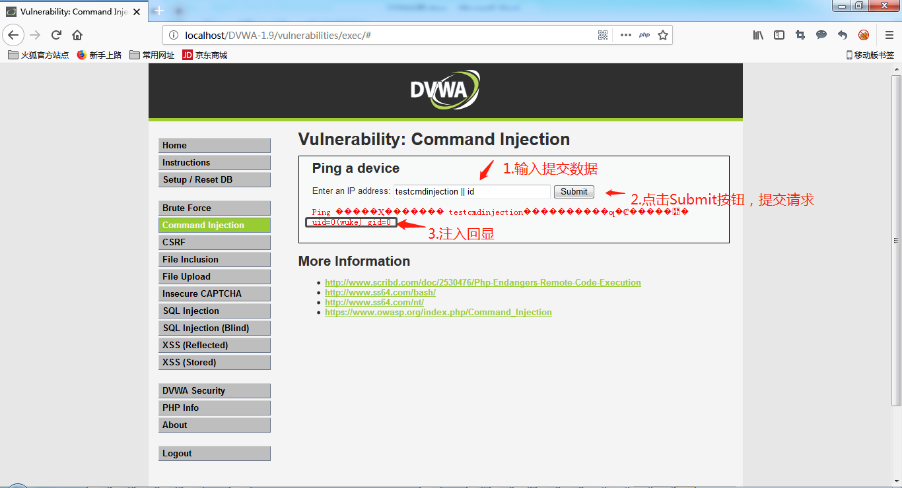

3. 分析结果

    在包含注入命令数据提交后可根据回显结果是否包含执行命令结果特征进行判断是否存在注入命令漏洞，例如在输入命令中包含id的数据，查看响应结果是否包含uid和gid

4. 代码分析

    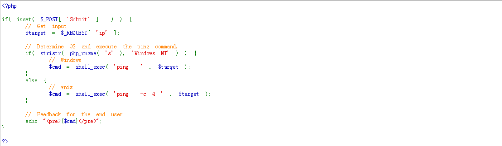

    说明：

    执行过程直接将输入数据拼写到字符串中进行命令执行，无任何保护措施，可尝试任意可执行的命令（包括反弹shell）

5. 自编Python脚本进行命令注入

    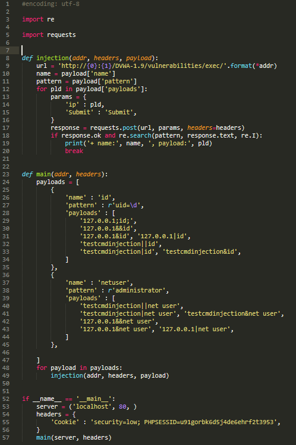

    使用：

    + 从浏览器中copy登陆成功后的cookie信息
    + 使用python3运行脚本

    说明：

    + 使用requests发送请求到dvwa，在提交时使用具有注入命令的参数，通过注入命令执行结果特征码进行识别是否具有漏洞

### MEDIUM级别 ###

1. 设置DVWA安全级别为Medium

2. 使用firefox浏览器发起登陆请求

    分别填写以下提交数据:

    + 127.0.0.1&;&id
    + 127.0.0.1&;&net user
    + testcmdinjection||id
    + testcmdinjection||net user
    + 127.0.0.1&id
    + 127.0.0.1|net user
    + testcmdinjection&id
    + testcmdinjection|net user

    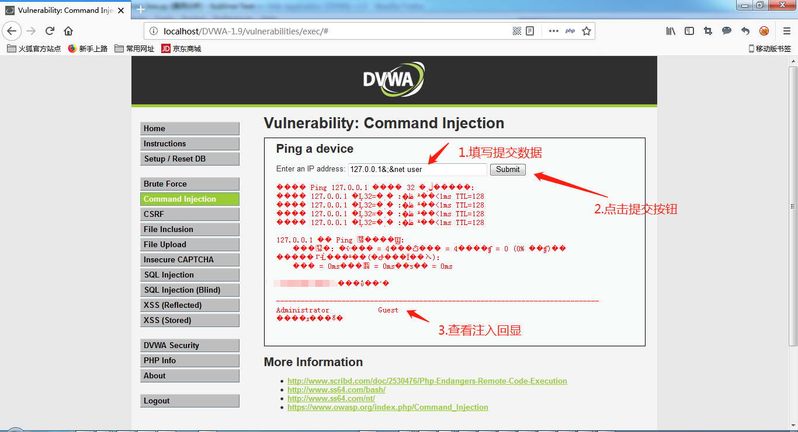

    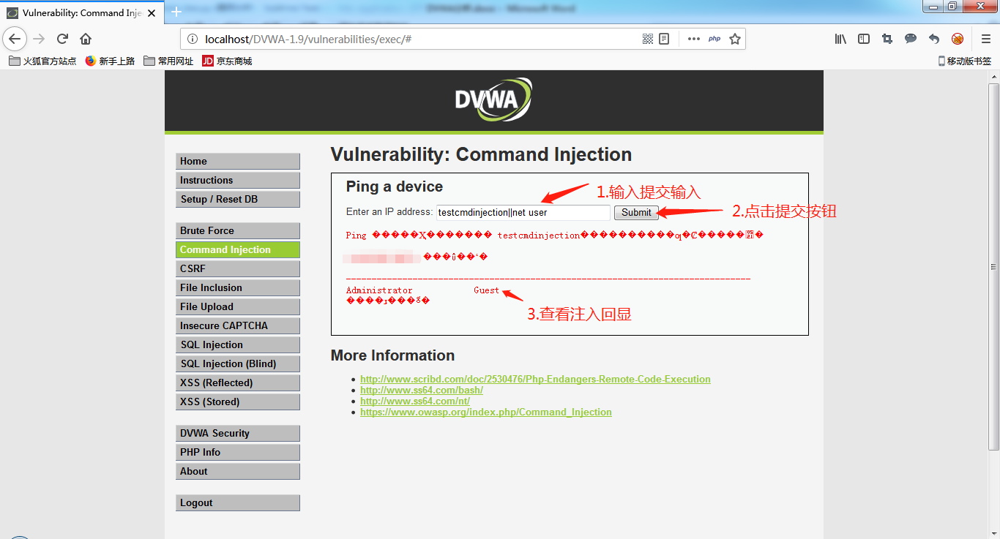

3. 分析结果

    在包含注入命令数据提交后可根据回显结果是否包含执行命令结果特征进行判断是否存在注入命令漏洞，例如在输入命令中包含net user的数据，查看响应结果是否包含administrator

4. 代码分析

    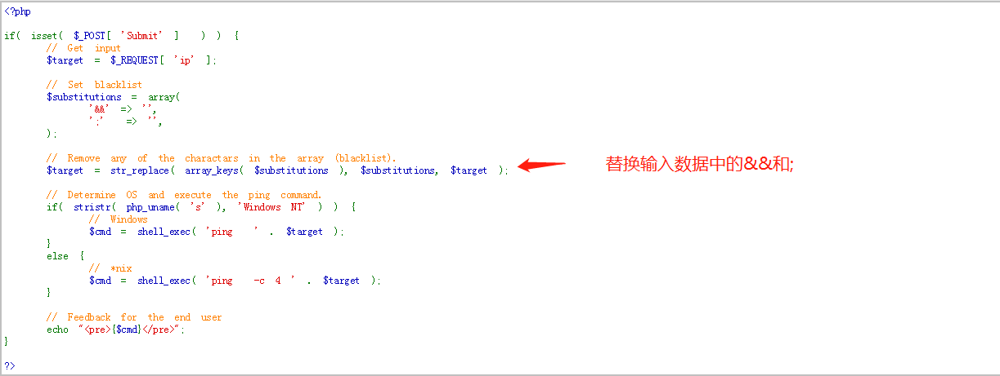

    说明：

    针对输入数据删除&&和;

5. 自编Python脚本进行命令注入

    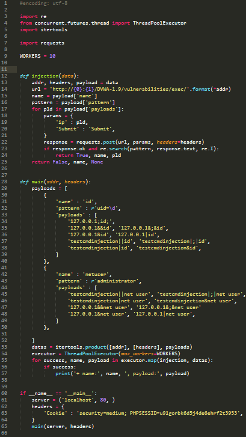

    使用：

    + 从浏览器中copy登陆成功后的cookie信息
    + 使用python3运行脚本

    说明：

    + 使用线程池机制同时发起多个请求
    + 使用requests发送请求到dvwa，在提交时使用具有注入命令的参数，通过注入命令执行结果特征码进行识别是否具有漏洞

### HIGH级别 ###

1. 设置DVWA安全级别为High

2. 使用firefox浏览器发起登陆请求

    分别填写以下提交数据:

    + 127.0.0.1|id
    + testcmdinjection|net user

    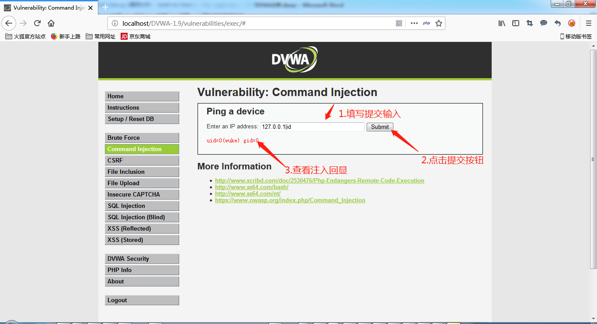

    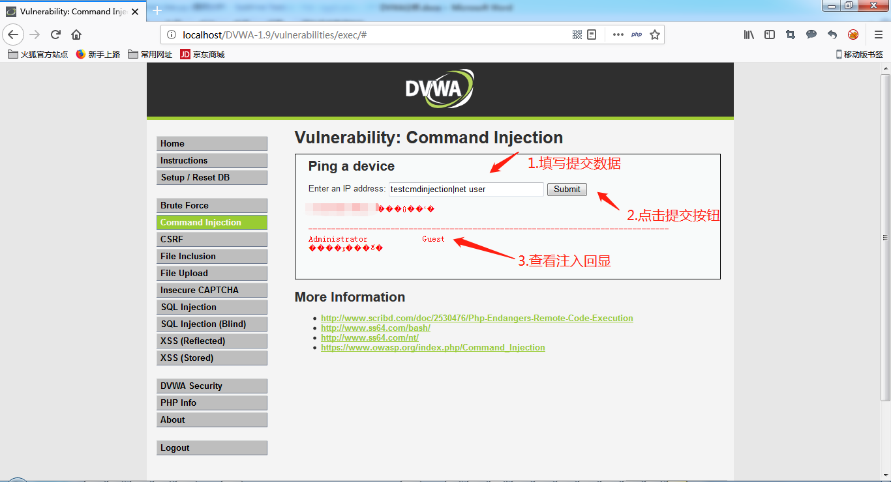

3. 分析结果

    在包含注入命令数据提交后可根据回显结果是否包含执行命令结果特征进行判断是否存在注入命令漏洞，例如在输入命令中包含net user的数据，查看响应结果是否包含administrator

4. 代码分析

    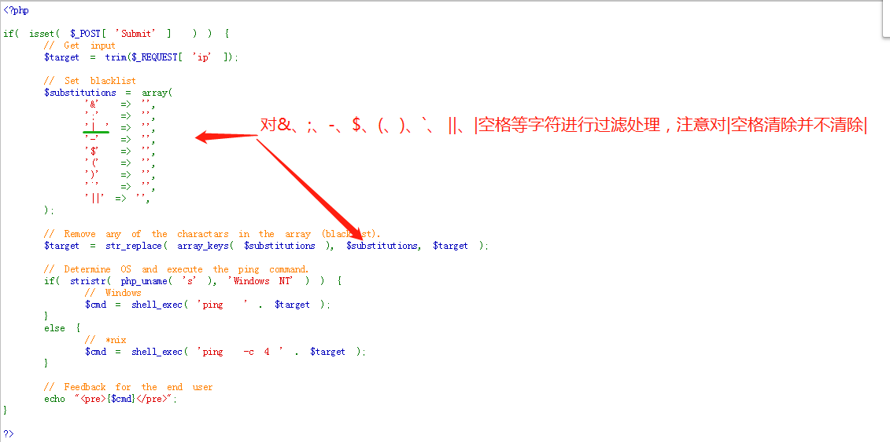

    说明：

    针对输入数据删除&、;、-、$、(、)、\`、||、|空格等字符（注意删除|空格,对|并不进行处理）

5.  自编Python脚本暴力破解

    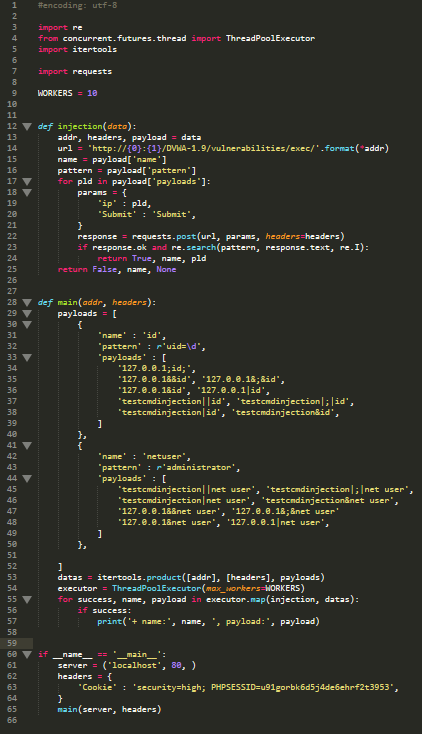

    使用：

    + 从浏览器中copy登陆成功后的cookie信息
    + 使用python3运行脚本

    说明：

    + 使用线程池机制同时发起多个请求
    + 使用requests发送请求到dvwa，在提交时使用具有注入命令的参数，通过注入命令执行结果特征码进行识别是否具有漏洞

## 修复建议 ##

1. 使用白名单对提交数据类型和格式进行严格验证

2. 限制执行命令由用户提交，使用白名单限制执行命令

3. 避免web服务器启动用户权限过高
