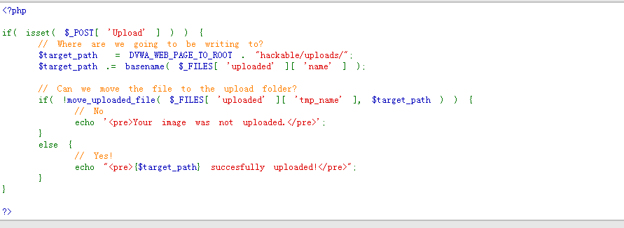

# DVWA之文件上传 #

## 漏洞概述 ##

文件上传是指攻击者通过上传可执行脚本功能，从而获取服务器端可执行命令的权限

## 测试工具 ##

firefox浏览器，burpsuite，中国菜刀

## 测试方法 ##

### LOW级别 ###

1. 设置DVWA安全级别为LOW

2. 使用浏览器上传恶意脚本进行攻击

    

    

    

    

3. 代码分析

    

    说明：

    上传文件过程无任何保护措施，直接使用将上传文件移动到可访问的hackable/uploads目录下

### MEDIUM级别 ###

1. 设置DVWA安全级别为Medium

2. 启动burpsuite并开启代理

    

3. 设置firefox浏览器代理为127.0.0.1:8080

    

4. 开启burpsuite拦截

    

5. 使用浏览器上传恶意脚本进行攻击

    

    

    

    

6. 关闭burpsuite拦截功能，使用浏览器请求上传文件

    

7. 代码分析

    

    说明：

    在上传过程中对文件类型进行白名单限制（文件类型来源自数据提交的content-type,可通过篡改绕过数据检查）

### HIGH级别 ###

1. 设置DVWA安全级别为High

2. 准备攻击文件(图片木马)

    

    

    

    

3.  借助命令实现文件包含漏洞利用

    

4.  使用中国菜刀连接webshell

    

    

    

    

5.  代码分析

    

    说明：

    在上传过程中对文件后缀类型进行白名单限制，同时对文件大小以及图片尺寸大小进行检查，需要制作图片木马并结合命令注入（重命名文件名）进行漏洞利用

## 修复建议 ##

1. 设置项目目录权限：可写目录不执行，执行目录不可写

2. 使用白名单机制对文件类型(mine-type)和文件后缀进行限制

3. 对上传文件大小进行限制

4. 文件存储到服务器时文件名称随机化，禁止使用用户上传指定的文件名称

5. 针对图片文件使用压缩或重设图片像素大小

6. 上传文件存放在独立服务器使用
