# DVWA之SQL注入 #

## 漏洞概述 ##

SQL注入是指应用程序中数据与操作未作分离，导致将攻击者提交的恶意数据拼写到SQL语句中当作代码执行从而产生攻击行为

## 测试工具 ##

firefox浏览器，sqlmap，burpsuite

## 测试方法 ##

### LOW级别 ###

1. 设置DVWA安全级别为LOW

2. 使用浏览器发起查找请求

    payload: `1' or '1'='1`

    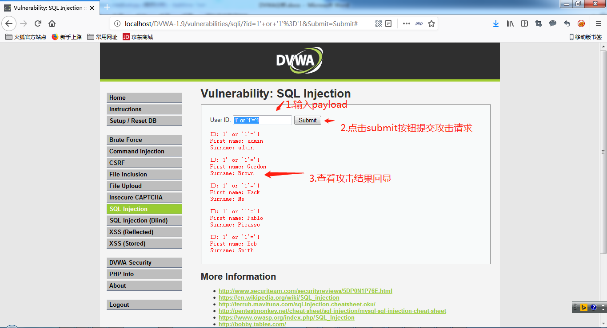

3. 使用sqlmap进行sql注入

    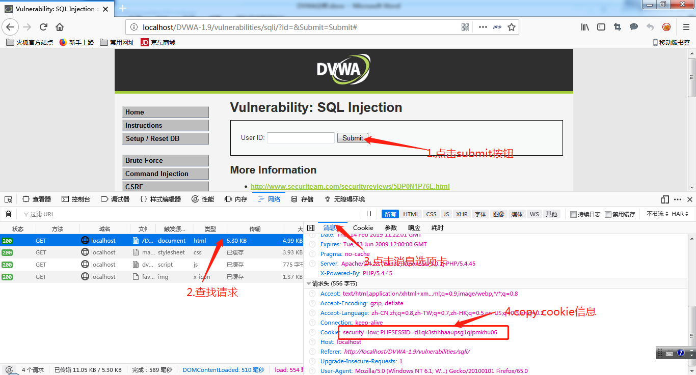

    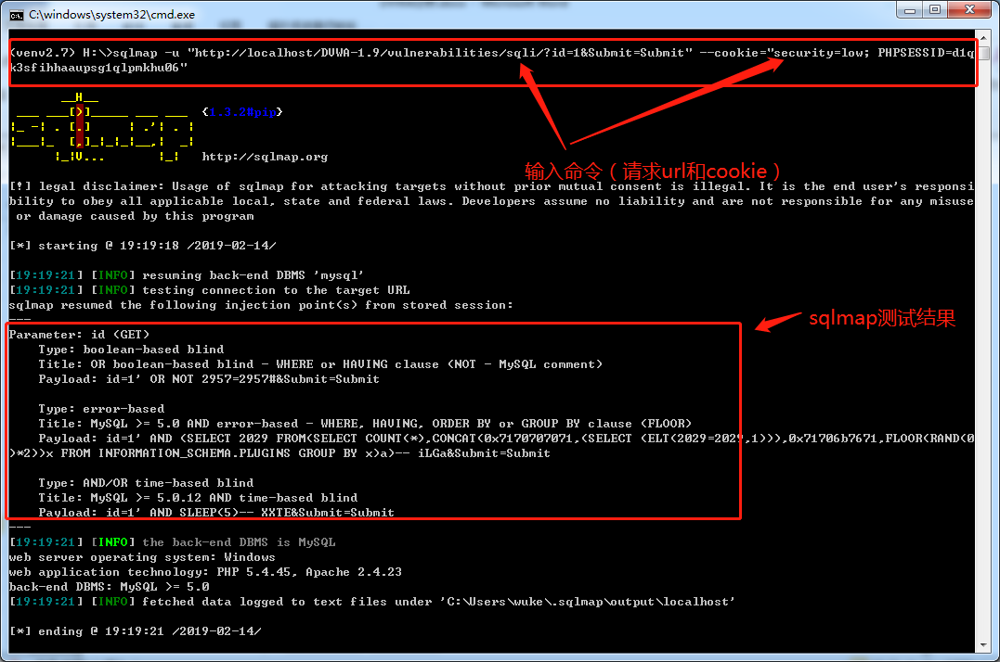

4. 代码分析

    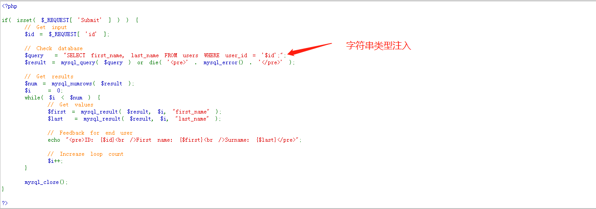

    说明：

    查找过程直接将提交的id拼写到sql中进行执行，存在字符串类型注入

### MEDIUM级别 ###

1. 设置DVWA安全级别为Medium

2. 启动burpsuite并开启代理

    

3. 设置firefox浏览器代理为127.0.0.1:8080

    

4. 开启burpsuite拦截

    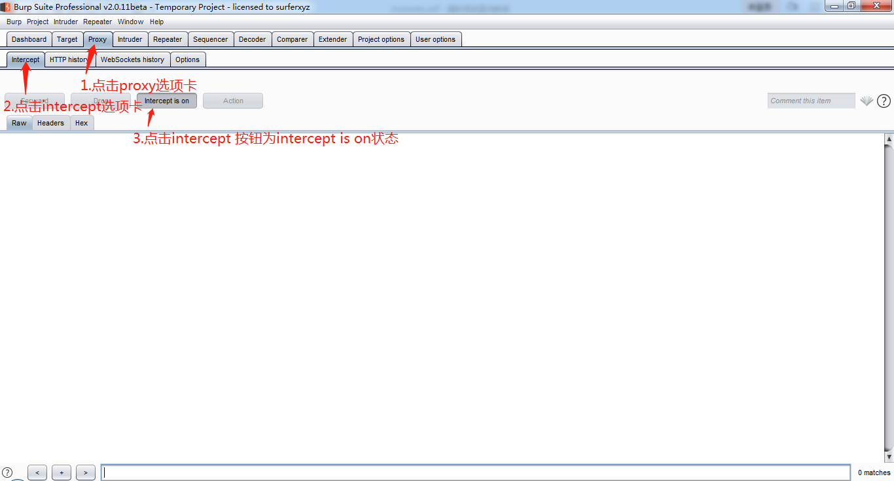

5. 使用firefox浏览器发起查询请求

    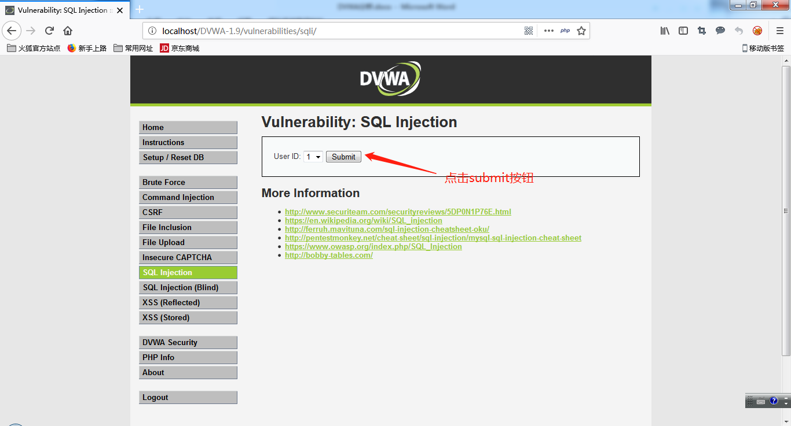

6. 使用burpsuite进行SQL注入

    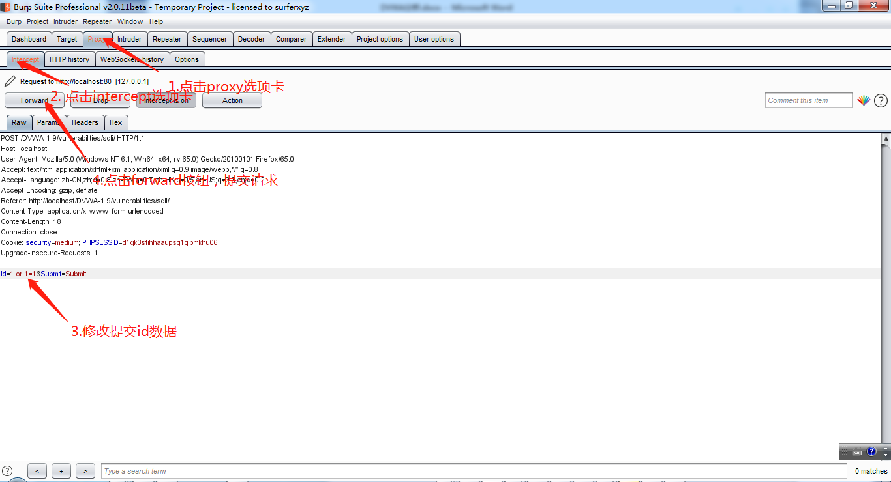

7. 分析结果

    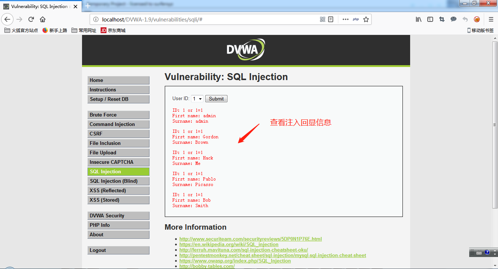

8. 使用sqlmap进行sql注入

    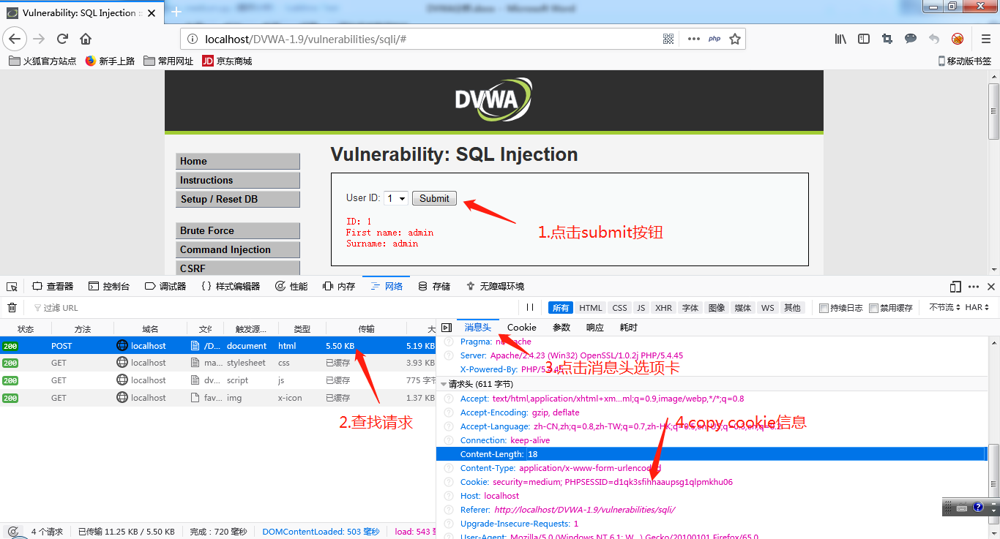

    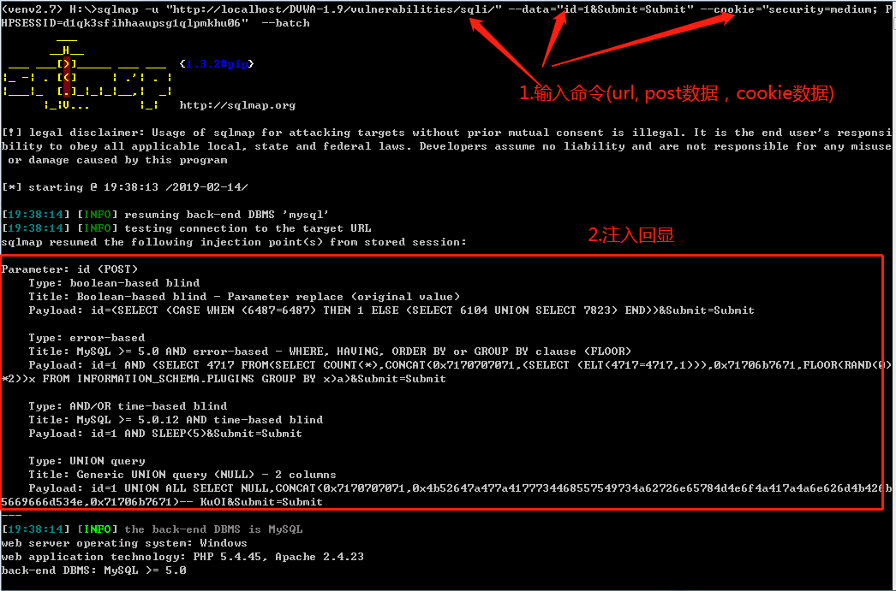

9. 代码分析

    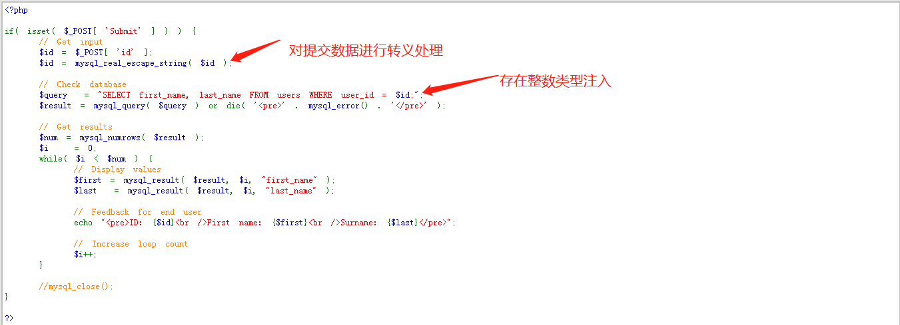

    说明：

    针对提交的进行转义处理，但对于整数类型注入限制有限，可利用整数类型注入进行利用

### HIGH级别 ###

1. 设置DVWA安全级别为High

2. 用浏览器发起攻击

    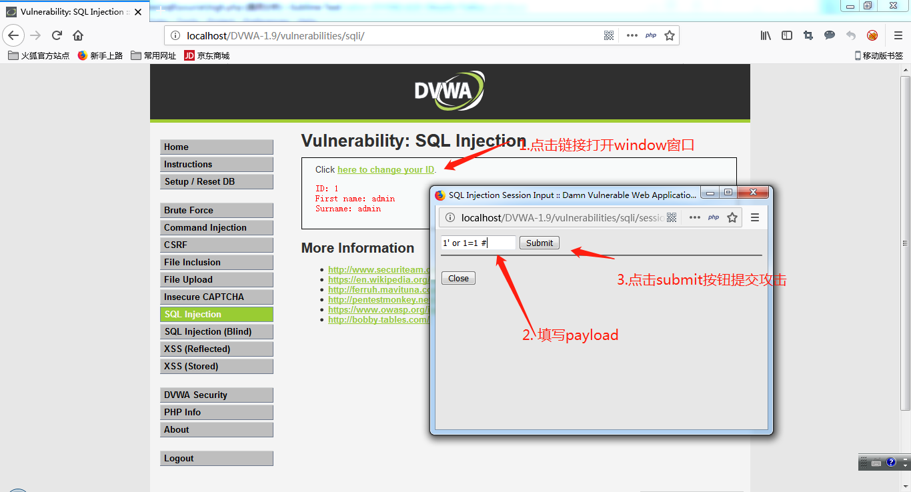

    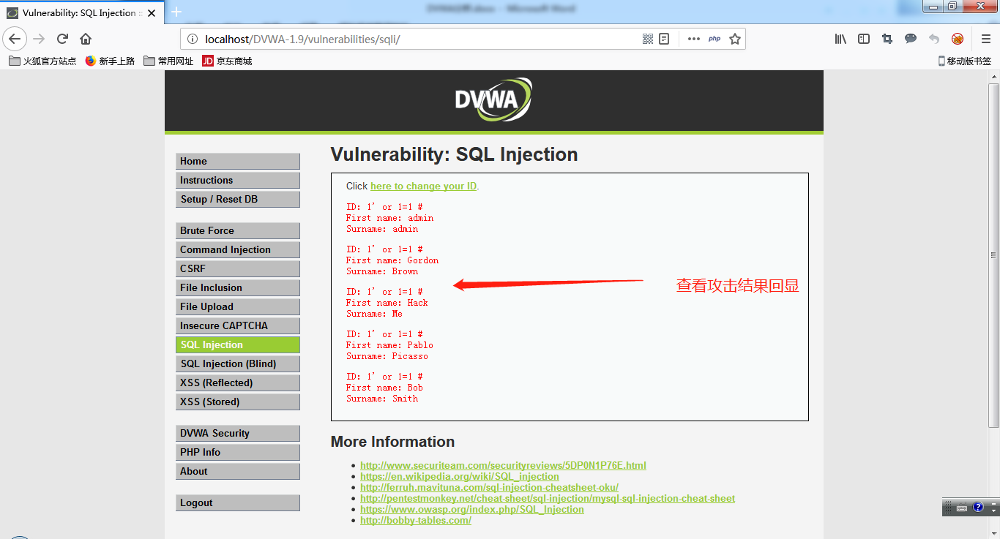

3. 代码分析

    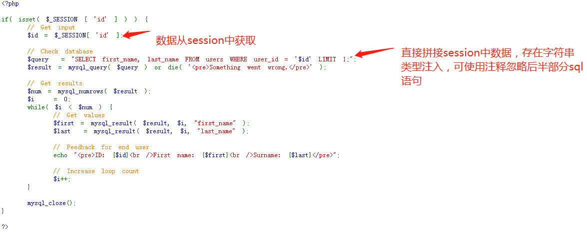

    说明：

    数据从Session中获取，但存放过程中未作任何转义和过滤，在sql中存在limit 1, 但可以通过提交数据中带注释符进行忽略

## 修复建议 ##

1. 使用预处理方式将数据和操作分离（在SQL中使用?占位数据）

2. 对数据严格进行类型和格式检查

3. 使用安全函数对数据进行转义

4. 避免web服务器启动和数据库操作用户权限过高
