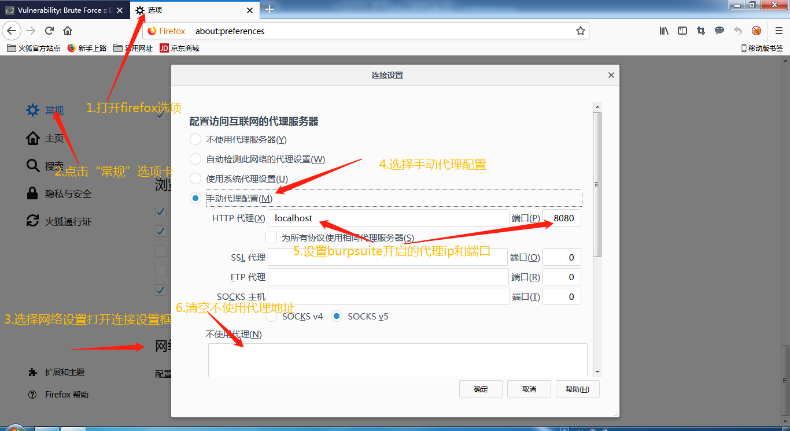

# DVWA之SQL盲注 #

## 漏洞概述 ##

SQL盲注是指不能根据报错和回显来判断是否存在SQL注入时，攻击人员通过提交逻辑条件来观察响应结果来判断是否存在SQL注入的方式

## 测试工具 ##

firefox浏览器，burp suite，sqlmap

## 测试方法 ##

### LOW级别 ###

1. 设置DVWA安全级别为LOW

2. 启动burpsuite并开启代理

    

3. 设置firefox浏览器代理为127.0.0.1:8080

    

4. 关闭burpsuite拦截

    

5. 使用firefox浏览器发起查询请求

    

6. 使用burpsuite进行SQL注入攻击

    

7. 使用Decoder模块生成payload

    

    分别对以下数据进行URL数据编码payload

    + `1 or 1=1`
    + `1 and 1=2`
    + `1' or '1'='1`
    + `1' and '1'='2`

8. 使用重放模块进行SQL注入测试

    

    分别将提交数据修改为生成的四个payload进行请求操作，并发送到比较模块

9. 使用比较模块分别对整数类型/字符串类型逻辑and和or之间的响应结果进行比较

    

10. 分析结果

    

    针对字符串类型比较结果中，逻辑or请求的结果显示数据存在，逻辑and请求的结果显示数据不存在，从而判断存在SQL注入

11. 使用sqlmap进行测试

    

    

12. 代码分析

    

    说明：

    查询条件直接拼写提交数据到SQL语句中，此处存在字符串类型注入，针对查询结果进行抑制错误输出并根据查下结果数量控制显示结果，此处无法根据查询结果数量和错误输出进行是否存在SQL判断，需要采用盲注方式

### MEDIUM级别 ###

1. 设置DVWA安全级别为Medium

2. 启动burpsuite并开启代理

    

3. 设置firefox浏览器代理为127.0.0.1:8080

    

4. 关闭burpsuite拦截

    

5. 使用firefox浏览器发起查询请求

    

6. 使用burpsuite进行SQL注入攻击

    

7. 使用重放模块进行SQL注入测试

    

    分别将提交数据修改为以下的四个payload进行请求操作，并发送到比较模块

    + `1 or 1=1`
    + `1 and 1=2`
    + `1' or '1'='1`
    + `1' and '1'='2`

8. 使用比较模块分别对整数类型/字符串类型逻辑and和or之间的响应结果进行比较

    

9. 分析结果

    

    针对整数类型比较结果中，逻辑or请求的结果显示数据存在，逻辑and请求的结果显示数据不存在，从而判断存在SQL注入

10. 使用sqlmap进行测试

    

    

11. 代码分析

    

    说明：

    查询条件直接拼写提交数据到SQL语句中，此处存在字符串类型注入，针对查询结果进行抑制错误输出并根据查下结果数量控制显示结果，此处无法根据查询结果数量和错误输出进行是否存在SQL判断，需要采用盲注方式

### HIGH级别 ###

1. 设置DVWA安全级别为High

2. 启动burpsuite并开启代理

    

3. 设置firefox浏览器代理为127.0.0.1:8080

    

4. 关闭burpsuite拦截

    

5. 使用firefox浏览器发起查询请求

    

    点击submit按钮提交数据服务器将提交数据通过set-cookie存储到浏览器中，刷新页面查询id通过cookie再次提交到服务器

6. 使用burpsuite进行SQL注入攻击

    

7. 使用重放模块进行SQL注入测试

    

    分别将cookie提交数据修改为以下的四个payload进行请求操作，并发送到比较模块

    + `1 or 1=1`
    + `1 and 1=2`
    + `1' or '1'='1`
    + `1' and '1'='2`

8. 使用比较模块分别对整数类型/字符串类型逻辑and和or之间的响应结果进行比较

    

9. 分析结果

    

    针对整数类型比较结果中，逻辑or请求的结果显示数据存在，逻辑and请求的结果显示数据不存在，从而判断存在SQL注入

10. 使用sqlmap进行测试

    

    

11. 代码分析

    

    说明：

    查询条件直接拼写从cookie中提交数据到限制查询结果SQL语句中，此处存在字符串类型注入，针对查询结果进行抑制错误输出并根据查下结果数量控制显示结果，此处无法根据查询结果数量和错误输出进行是否存在SQL判断，需要采用盲注方式

## 修复建议 ##

1. 使用预处理方式将数据和操作分离（在SQL中使用?占位数据）

2. 对数据严格进行类型和格式检查（url，post data，cookie等用户可以控制的数据）

3. 使用安全函数对数据进行转义

4. 避免web服务器启动和数据库操作用户权限过高
