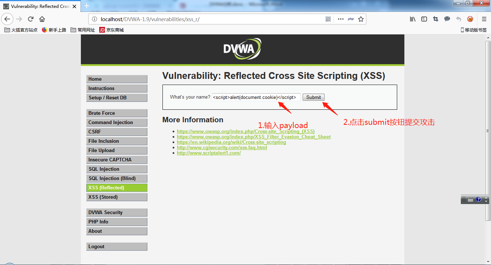
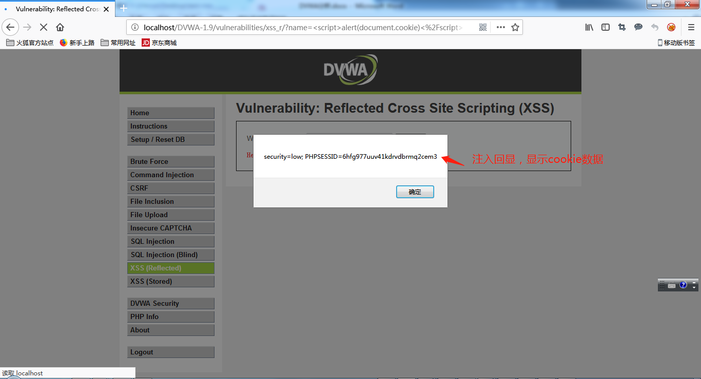
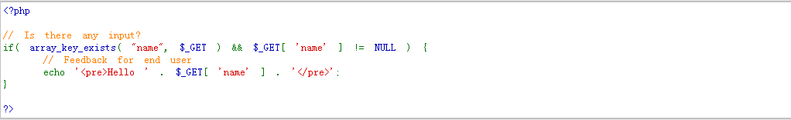
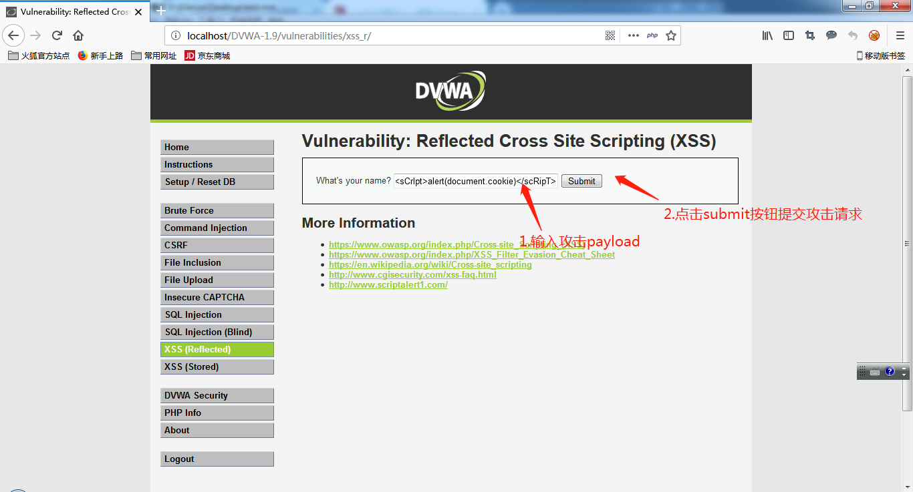
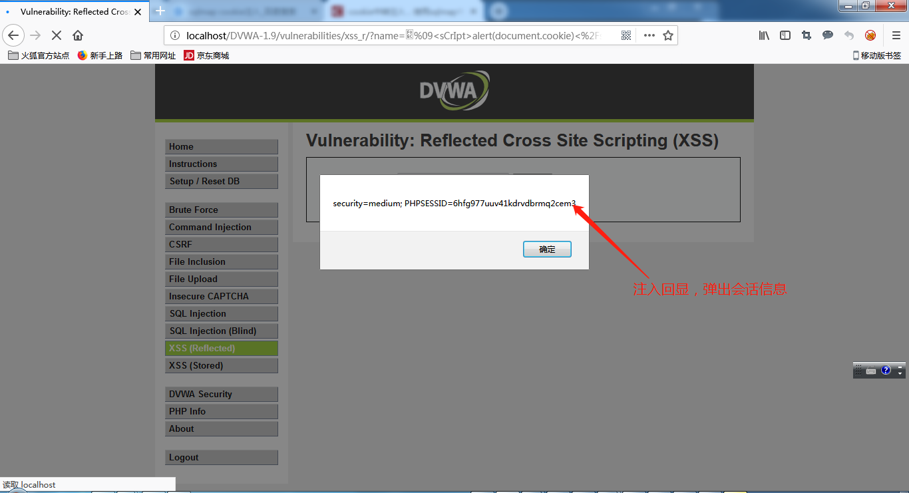
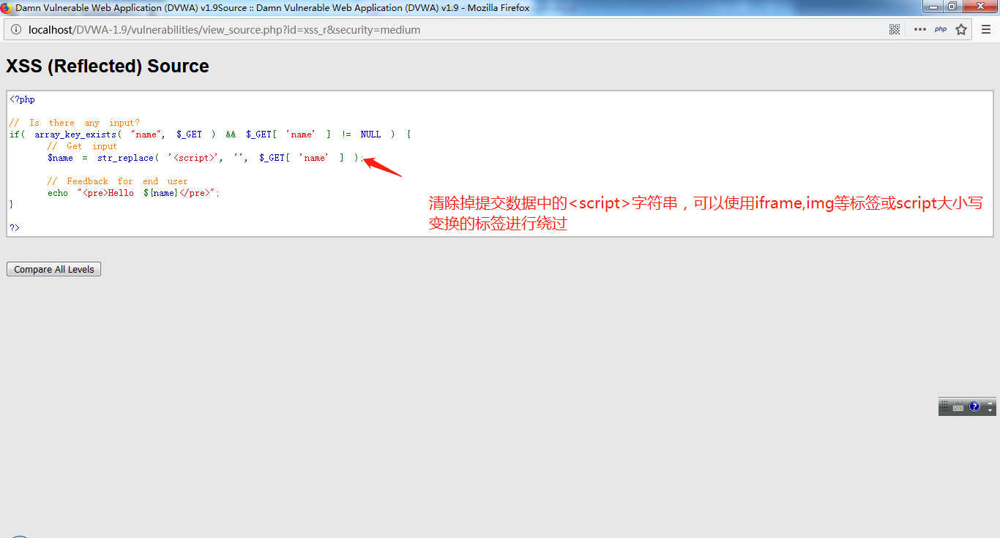
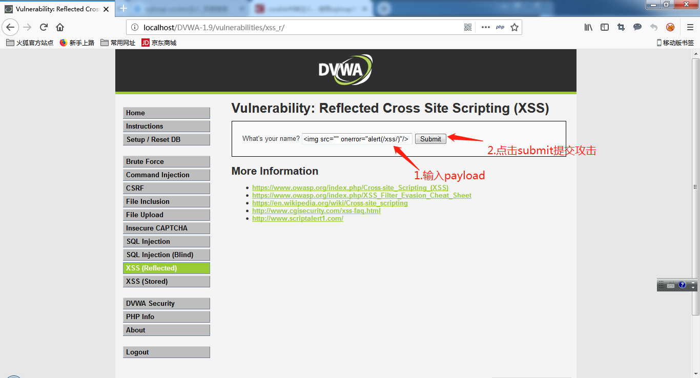
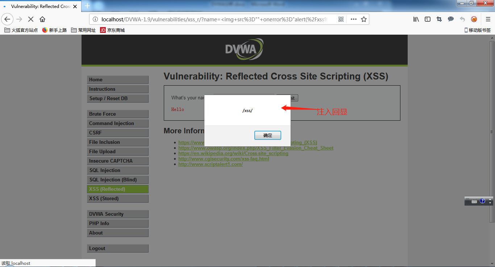
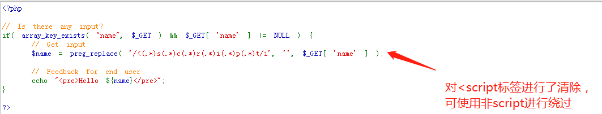

# DVWA之反射型XSS #

## 漏洞概述 ##

反射型XSS是指应用程序直接将攻击者提交的具有恶意代码的数据回传浏览器，因html注入导致页面被植入恶意代码从而被攻击者控制浏览器

## 测试工具 ##

firefox浏览器

## 测试方法 ##

### LOW级别 ###

1. 设置DVWA安全级别为LOW

2. 使用浏览器进行XSS攻击

    在浏览器中输入payload:

    + ``
    + ``
    + ``
    + `<iframe src="" onload="alert(document.cookie)"></iframe>`

    

3. 分析结果

    

4. 代码分析

    

    说明：

    应用程序直接将提交数据输出到html页面，未对提交数据做任何过滤检查和转义操作，可直接使用提交数据包含xss payload进行攻击

### MEDIUM级别 ###

1. 设置DVWA安全级别为Medium

2. 使用浏览器进行XSS攻击

    在浏览器中输入payload:

    + `<sc`
    + ``
    + ``
    + `<iframe src="" onload="alert(document.cookie)"></iframe>`

    

3. 分析结果

    

4. 代码分析

    

    说明：

    应用程序直接将提交数据中的`<script>`字符串进行过滤后输出到html页面，但可以通过script大小写变换后的标签、二次变化的`<scr<script>ipt>`、iframe、img等标签进行绕过，从而成功利用漏洞

### HIGH级别 ###

1. 设置DVWA安全级别为High

2. 使用浏览器进行XSS攻击

    在浏览器中输入payload:

    + ``
    + `<iframe src="" onload="alert(document.cookie)"></iframe>`

    

3. 分析结果

    

4. 代码分析

    

    说明：

    应用程序直接将提交数据中的`<script`字符串进行过滤后输出到html页面，但可以通过iframe、img等标签进行绕过，从而成功利用漏洞

## 修复建议 ##

1. 禁用js读取cookie(设置cookie为httponly)

2. 在页面输出数据时对<、>、&、 '、"、/等字符进行html实体转义

3. 对输入数据中<、>、&、 '、"进行严格检查
